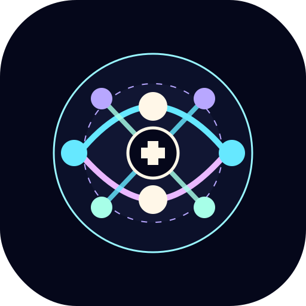

<div align="center">
  

  <h1>Moonweave Agent Ontology</h1>

  <p>
    面向智能体系统的单一源本体工程：递归 YAML 源、确定性 JSON 投影，以及 Graphify 风格浏览器。
  </p>

  <p>
    <a href="https://moonweave-ai.github.io/moonweave-ai-agent-schema/">在线浏览器</a>
    · <a href="../README.md">英文文档</a>
    · <a href="README.ja.md">日文文档</a>
    · <a href="../src/generated/agent-ontology.json">生成本体 JSON</a>
  </p>
</div>

## 项目定位

Moonweave Agent Ontology 是面向智能体系统构建的受治理本体产物。它不是提示词集合、排行榜，也不是一次性图谱样机。

当前仓库只有一个可编辑本体权威源：

- `ontology/node.yaml` 是根节点，保存根本体元数据、治理信息与来源目录；
- 每个下级节点都在自己的目录中保存一个 `node.yaml`；
- 直接子目录就是本体层级，不再使用 `children/` 包装目录；
- 不再保留平行 JSON、CSV、Markdown、迁移、ABox、TBox、Instance、Schema、Evidence 等第二事实源；
- `src/generated/` 中的文件只读生成产物，不允许手工编辑；
- `src/` 中的 React 浏览器按当前 Graphify 风格展示生成投影。

定义、解释、实例、正反例、结构字段、约束、受控值、来源声明、评审说明和关系细节都附着在对应节点或关系上；它们不是额外图节点，也不能形成第二套浏览结构。

## 源文件结构

物理目录必须直接表达逻辑本体树：

```text
ontology/
|-- node.yaml
|-- info-plane/
|   |-- node.yaml
|   `-- <module>/
|       |-- node.yaml
|       `-- <concept>/
|           |-- node.yaml
|           `-- <narrower-concept>/
|               `-- node.yaml
|-- runtime-plane/
|   `-- ...
`-- tool-plane/
    `-- ...
```

构建器和测试强制以下规则：

- 只读取 `ontology/` 这一处源；
- 每个节点目录只能有一个 `node.yaml`；
- 概念可按逻辑任意加深；
- 文件所在父子位置就是主层级；
- 交叉关系只作为关系信息存在，不改变文件归属；
- 历史、迁移、弃用材料不再作为源权威保留；
- 生成产物必须由 YAML 原子构建，并用 `npm run ontology:check` 做只读漂移检查。

## 八个领域

顶层包含八个运行关注域：

| 领域 | 范围 |
|---|---|
| 上下文摄入与暂存 | 可观察内容如何进入智能体步骤或模型调用上下文。 |
| 控制与编排 | 目标、计划、路由、委派、交接、闸门和编排组合。 |
| 运行状态与轨迹 | 会话、尝试、结果、权限绑定、轨迹事件、检查点和产物。 |
| 互操作与适配 | 协议、框架、基准、状态图、模式/导出、语言剖面、图谱和前端适配。 |
| 能力与资源调用 | 能力注册、工具、资源、提示、API、发现、调用和副作用证据。 |
| 信任、策略与安全 | 信任边界、权限、策略、沙箱、注入防御、提交门、脱敏和披露。 |
| 可观测性与反馈 | 诊断、日志、指标、审查、修正、评估、恢复动作和反馈循环。 |
| 记忆与上下文持久化 | 记忆库、记录、摄入、分块、索引、检索、摘要、生命周期和投毒控制。 |

领域和模块是稳定入口，不是深度限制。概念节点可按真实逻辑继续向下展开。

## 构建与验证

安装依赖：

```bash
npm ci
```

构建本体投影：

```bash
npm run ontology:build
```

检查生成物是否漂移：

```bash
npm run ontology:check
```

启动本地浏览器：

```bash
npm run dev
```

运行完整验证：

```bash
npm run verify
```

常用命令：

| 命令 | 作用 |
|---|---|
| `npm run ontology:build` | 将 `ontology/` 编译为 `src/generated/agent-ontology.json`、`source-index.json` 和 `ontology-community-graph.json`。 |
| `npm run ontology:check` | 只读检查生成物是否与 YAML 源一致。 |
| `npm run ontology:communities:check` | 按 canonical 模块归属验证社区图。 |
| `npm run test:unit` | 重建本体后运行单元与集成测试。 |
| `npm run build` | 类型检查、Vite 构建、站点 manifest 生成和站点产物校验。 |
| `npm run e2e` | 浏览器契约测试。 |

## 浏览器

浏览器只保留一张 Graphify 风格图谱：

- 浏览器端使用 `vis-network` `ForceAtlas2Based` 力导向视图；
- 节点按 canonical 模块归属着色；
- 节点大小只是结构枢纽视觉提示，不代表业务重要性；
- 边标签默认不挤在画布上，关系语义在详情与悬浮信息中解释；
- 来源、实例、字段、约束、受控值、评审说明和关系细节都在节点/关系信息面板中展示；
- 不再存在平行 Schema、Instance、Evidence、Adapter、ABox 或 TBox 页面。

发布社区来自本体模块归属，而不是统计聚类。视觉布局只帮助人探索图谱，不得重写本体归属。

## 在线发布

GitHub Pages 发布浏览器：

[https://moonweave-ai.github.io/moonweave-ai-agent-schema/](https://moonweave-ai.github.io/moonweave-ai-agent-schema/)

生产站点必须由同一提交生成。本体源指纹、生成规范本体、生成社区图和部署 commit 通过 build manifest 绑定。
